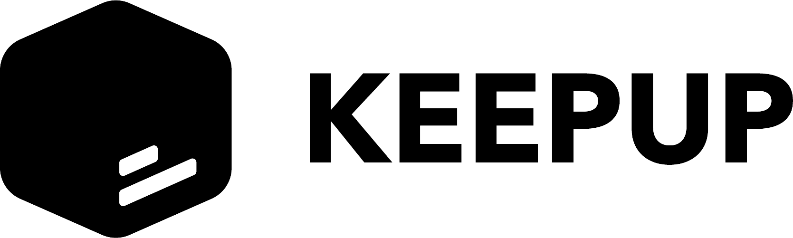

[![webapp-workflow-shield]][webapp-repo]
[![user-workflow-shield]][user-repo]
[![market-workflow-shield]][market-repo]
[![game-workflow-shield]][game-repo]
[![steam-workflow-shield]][steam-repo]

 
 

<a href="https://keepup-vuejs-app.herokuapp.com/">

<a/>

<h3 align="center">KeepUp SPA</h3>

Documentation repository for <a  href="https://keepup-vuejs-app.herokuapp.com/">KeepUp</a> software application.

 

## Table of Contents

* [Project Scope](#project-scope)
  * [System Overview](#system-overview)
* [Web Application](#web-application)
  * [User-friendly](#user-friendly)
  * [Fullstack](#fullstack)
* [Software Quality](#software-quality)
  * [Secutity Concerns](#security-concerns)
  * [Testing](#testing)
* [CI/CD](#cicd)
  * [Continuous Integration](#continuous-integration)
  * [Continuous Deployment](#continuous-deployment)
* [Indepth Documentation](#indepth-documentation)

 

## Project Scope

Keepup as a web application utilizing Steam's API for users to view their inventory's value, game stats such as how much time they have spent playing games since the creation of their account and more. The web application can be accessed at `https://keepup-vuejs-app.herokuapp.com/`, which is hosted on Heroku (more on that later).

The application is comprised of multiple endpoints interconnected between each other and, in combination with a frontend application, communicates with the Steam API. All endpoints and the web application is hosted on Heroku (for the purposes of this project, I could do real-life work with [CI/CD](#ci-cd) ).

### System overview

The backend system is divided into small nodes; in a micro-services like structure. Most endpoints/nodes uses Nodejs as it is often used as to run backend servers 

Below is the C4 model of the software system (C1 & C2, C3 can be found in /architecture)

* #### C1: System Context with Steam API:

* #### C2: Container Diagram of the Application:

 

## Web Application

### User-friendly

The typical user persona for Keepup are people who play video games specifically on the Steam platform. Consequently, the web application's appearance takes a lot of insperation from Steam's current website such as having the similar color palettes or having its main content focused strictly on the center. From various simple reviews, it was noted that performing tasks was intutive and fairly stright forward.

### Fullstack

* #### Frontend Framework

[VueJs](https://vuejs.org/) was used as a frontend development framework for the web application.

VueJs (in combination with vuex and vue-router) is by modern standards, a robust framework for developing a web/desktop applications. It uses a MVVM pattern (over the more traditional MVC pattern) which has a few benefits (namely, better separation of tasks between the logic/view layer, faster to get a MVP, minimum viable product, running for feature testing, etc).

* #### Object Relational Mapping

KeepUp uses the [Steam API](https://steamcommunity.com/dev) to get most of its relevant data such as game information, player statistics, market items, etc. In other words, KeepUp takes advantage of the Steam's stored data system to get its own information, which reduces the need to store and manage a lot of data. There are, however, certain things that KeepUp keeps track of: user registration information. Users can sign up to see their steam stats when they have linked their steam account.

To save data and keep persistence, KeepUp uses [MongoDB](https://www.mongodb.com/). 

To learn more about what is saved within the database and how encryption is used to store [User](https://github.com/noahgreff/user-api-endpoint#user-object) objects, check the [user endpoint](https://github.com/noahgreff/user-api-endpoint)'s README.md file under the *User Object* section.

* #### Asynchronous Communication

All endpoints/nodes convey data between each other through asynchronous communication. By using Nodejs as a backend runtime environment and the express npm package, making calls to the backend was fast. Although Javascript is single-threaded, with Nodejs (which is multi-threaded), operations are fast and imporves reliablity and server response time, especially for a micro-service-based backend architecture.  

 

## Software Quality

### Security Concerns

Bellow are some of the key security vulnerabilities that this application addressed enumerated in the [OWASP top 10](https://owasp.org/www-project-top-ten/)

|risk|control|
|---:|---|
| **injection**| Injections are commonly performed from malicious user-inputs on the frontend to collect sensitive data (e.i. user credentials). Within my application, there are multiple layers to prevent attacks like such. On the frontend, vuejs uses typed models to [escapes html/javascript](https://vuejs.org/v2/guide/security.html#Injecting-HTML) user-inputs to their intended data type. In the backend, I used mongodb (and a few validation methods within the [source code][user-repo]) which avoids using DML/SQL directly to interact with the DB | 
| **broken authentication**| User authentication works with session tokens. Each time a user logins, a new session token is provided and the old one gets discarded. The session token is used as a mean to identify the user in the backend (since the BE is stateless) when the user wants to perform restricted actions or actions that requires users to be authenticated (e.i. update info, delete account). In addition, the 2-step verification process protects a user's account even more and, in order to login with the user information, attackers would also need to have access to the user's email account (which itself uses robust security system provided by gmail, outlook, etc.) |
| **sensitive data exposure**| As mentioned previously, information such **passwords are encrypted** within the database which makes it one step harder for attackers to steal user credentials. Furthermore, sensitive data such the 2FA secret (used for 2-factor authentication) are only used internally. In other words, for example, when a user logins with 2fa enabled, a token is generated from the user's stored secret where the token is then sent to the user's email. Nowhere within the process was the secret exposed to the user-agent |

* #### Steam oAuth 
Additionally, when users link their Steam to their account, Keepup uses OAuth to securely retrieve steamids. This method protects users Steam information if their Keepup account were to be compromised.

### Testing

Doing testing ensures that every time new code gets push in production, the endpoints won't affect other endpoints in a negative ways (e.i. wrong data gets passed into the HTTP request which would cause unhandled errors to occur on the other end) make debugging very difficult and time consuming.

* #### Different types of tests performed

|test|description|example| 
|---:|---|---| 
| **Unit** | Ensures that multiple aspect of the endpoint work properly within the scope of the endpoint itself, on a *local* level | <ul><li>Correct data gets yield from a request</li><li>No *`null`* values are returned when an empty *`string`* was expected</li></ul> |
| **Integration** | Like the name suggests, integration testing is used to make sure *multiple endpoints* work/interact with one another correctly | <ul><li>`200`/`201`/`204`/etc... reponses are returned when making a request</li><li>Errors are handled correctly, including internal errors (e.i. `Server 500`)</li></ul>
| **Regression**| When tests fail, I can address the failures and adjust my code for it to work properly, configure new test cases when and prioritize | <ul><li>Reformatting JSON response data can cause certain tests to fail</li></ul>

* #### Static/Dynamic code analysis

##### Static

Static code analysis was done using [SonarQube](https://www.sonarqube.org/).

When writting code, SonarQube help in spotting various types of issues within the source code of a repository. While using SonarQube. mistakes were spotted such as repitition of code, old and unused declaration of variables as well as **security vulnerabilities**.

##### Dynamic

* Tools used to perform dynamic testing

|app/tool|description|example| 
|---:|---|---| 
| **Postman**| Using Postman when developing the application was crucial. It allows to do time-effective troubleshooting and analysis when dealing with http/https requests and responses | <ul><li>When testing the integrity of the **register process**, ensuring the right responses were being sent when registering with proper/faulty inputs in relation to the user endpoint</li></ul> |
| **mailtrap.io** | A very useful tool for sending emails without the hassle of *setting up* an smtp server | <ul><li>When login with 2 factor authentication enabled, being able to capture sent emails from my local machine and get the token from it. </li></ul>

 

## CI/CD

* ### Continuous Integration

Heroku in combination with Github actions is, in my opinion, a very powerful tool to perform effective continuous integration workflows. It allows me to work on code and do testing automatically after each `git push` and, once tests have passed successfully, can move further down into the CD pipeline. This improves reliability of the software.

* ### Continuous Deployment

Following the CI workflow, continuous deployment consists of bring new source code to Heroku repositories and subsequently pushing the changes into production in an automated way. Simply put, as mentioned before, once tests run successfully, the new code gets pushed to and deployed to Heroku. This allows me to save time and mitigates problems that could occur if trying to deploy not functioning code into production and only figuring the errors later on.

 

## Indepth Documentation

Further documentation can be found within the README file of each specific repo:

* [Market Item Endpoint][market-repo]
* [Game Endpoint][game-repo]
* [Steam Endpoint][steam-repo]
* [User Endpoint][user-repo]
* [Auth Endpoint][auth-repo]
* [Login Controller Endpoint][login-repo]
* [Register Controller Endpoint][register-repo]

[user-workflow-shield]: https://github.com/noahgreff/user-api-endpoint/workflows/User%20Endpoint%20CI/badge.svg
[user-repo]: https://github.com/noahgreff/user-api-endpoint/

[market-workflow-shield]: https://github.com/noahgreff/marketItem-api-endpoint/workflows/Market%20Endpoint%20CI/badge.svg
[market-repo]: https://github.com/noahgreff/marketItem-api-endpoint/

[game-workflow-shield]: https://github.com/noahgreff/game-api-endpoint/workflows/Game%20Endpoint%20CI/badge.svg
[game-repo]: https://github.com/noahgreff/game-api-endpoint/

[steam-workflow-shield]: https://github.com/noahgreff/steam-api-endpoint/workflows/Steam%20Endpoint%20CI/badge.svg
[steam-repo]: https://github.com/noahgreff/steam-api-endpoint/

[auth-workflow-shield]: https://github.com/noahgreff/auth-api-endpoint/workflows/Auth%20Endpoint%20CI/badge.svg
[auth-repo]: https://github.com/noahgreff/auth-api-endpoint/

[login-workflow-shield]: https://github.com/noahgreff/login-controller-api/workflows/Login%20Controller%20CI/badge.svg
[login-repo]: https://github.com/noahgreff/login-controller-api/

[register-workflow-shield]: https://github.com/noahgreff/register-controller-api/workflows/Register%20Controller%20CI/badge.svg
[register-repo]: https://github.com/noahgreff/register-controller-api/

[webapp-workflow-shield]: https://github.com/noahgreff/keepup-vuejs-app/workflows/Webapp%20CI/badge.svg
[webapp-repo]: https://github.com/noahgreff/keepup-vuejs-app/

